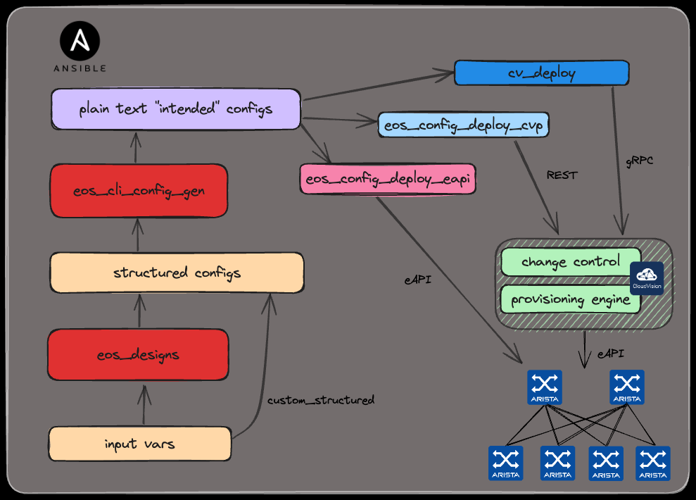

# TBD

<style scoped>section {font-size: 26px;}</style>

<!-- Do not add page number on this slide -->
<!--
_paginate: false
-->

```sh
$ whoami
# Petr Ankudinov, Senior Solutions Engineer
pa #@arista.com
$ date +"%b %Y"                 
Mar 2025
```

<!-- Add footer starting from this slide -->
<!--
footer: ''
-->

---

# Agenda

- TBD


---

# What is AVD



<style scoped>section {font-size: 18px;}</style>

- [AVD is an open-source project](https://avd.arista.com)
- AVD stands for "Architect, Validate, and Deploy"
- [Supported designs](https://avd.arista.com/5.2/ansible_collections/arista/avd/roles/eos_designs/index.html) as of AVD 5.2:
  - L3LS EVPN / L2LS / MPLS / Campus
  - WAN AutoVPN/CV Pathfinder
- Roles:
  - `arista.avd.eos_designs` - abstracted to low level variables
  - `arista.avd.cli_config_gen` - parse templates to build plain text configs
  - `arista.avd.cv_deploy` - push configurations to Arista CloudVision Portal (replaced `eos_config_deploy_cvp`)
  - `arista.avd.eos_config_deploy_eapi` - push configs to switches directly. Based on [`arista.eos.eos_config`](https://docs.ansible.com/ansible/latest/collections/arista/eos/eos_config_module.html). [`arista.eos`](https://galaxy.ansible.com/arista/eos) is maintained by RedHat ⚠️
  - `arista.avd.eos_validate_state` - validate operational state of Arista EOS devices (with ANTA)

---

# Q&A


- [Ansible AVD](https://avd.arista.com/)
- [This repository](https://github.com/ankudinov/avd-workshop-may-2025)

```diff
- One more slide!
+ No more slides.
```

```bash
git commit -m "The END!"
```

<!-- Add footer starting from this slide -->
<!--
footer: ''
-->
