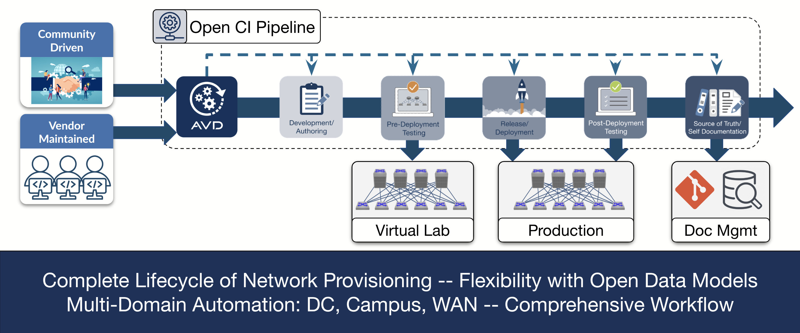
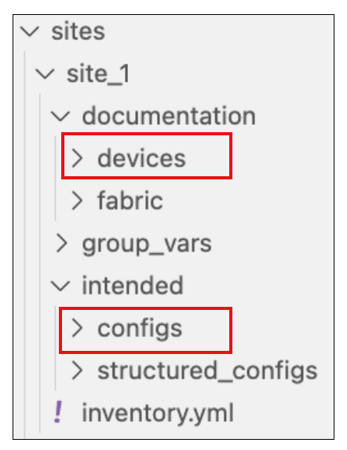

# WS:D3 - Arista AVD: Architect, Validate, and Deploy


> Build, deploy and test L3LS EVPN with Arista AVD

<style scoped>section {font-size: 22px;}</style>

<!-- Do not add page number on this slide -->
<!--
_paginate: false
-->

```python
#!/usr/bin/env python3

__author__ = [
  "Petr Ankudinov (pa@), Senior Solutions Engineer",
  "Guillaume Mulocher (gmulocher@), Senior Solutions Engineer",
  "Patrick Prangl (pprangl@), Systems Engineer"
]
```

```bash
$ date +"%b %Y"
May 2025
```

<!-- Add footer starting from this slide -->
<!--
footer: ''
-->

---

# Credits

<style scoped>section {font-size: 22px;}</style>


- Slides are created in [Marp](https://github.com/marp-team/marp) by Yuki Hattori
- Why:
  - Easy to build and share, rich content
  - Also ask yourself why people are presenting in PowerPoint when it comes to automation event. Slides are just another form of Markdown content build by CI.
- Check [Marp awesome list](https://github.com/marp-team/awesome-marp) and build your next slide deck in Marp!
- Most images are from [Pexels](https://www.pexels.com/) or generated by AI
- 🌐 Wi-Fi & Connectivity
  - Network Name: **AutoCon3**
  - Password: **PragueRocks!**

> Scan QR code to access the slide deck.

---

# Agenda

<style scoped>section {font-size: 22px;}</style>
<style scoped>p {font-size: 22px;}</style>

:fast_forward: Start: 14:00

- Arista AVD overview
- How to create AVD environment and ATD Lab overview
- 5 minutes intro to Makefile
- Build and deploy dual DC EVPN
- Services, endpoints and DCI
- Day 2 provisioning

☕ Break: 15:45 - 16:15

- CI with GitHub Actions and Pages
- Network testing hour with ANTA

🛑 Stop: 18:00


---

# What is AVD


<style scoped>section {font-size: 18px;}</style>

- [AVD is an open-source project](https://avd.arista.com)
- AVD stands for "Architect, Validate, and Deploy"
- [Supported designs](https://avd.arista.com/5.2/ansible_collections/arista/avd/roles/eos_designs/index.html) as of AVD 5.2:
  - L3LS EVPN / L2LS / MPLS / Campus
  - WAN AutoVPN/CV Pathfinder
- Roles:
  - `arista.avd.eos_designs` - abstracted to low level variables
  - `arista.avd.cli_config_gen` - parse templates to build plain text configs
  - `arista.avd.cv_deploy` - push configurations to Arista CloudVision Portal (replaced `eos_config_deploy_cvp`)
  - `arista.avd.eos_config_deploy_eapi` - push configs to switches directly. Based on [`arista.eos.eos_config`](https://docs.ansible.com/ansible/latest/collections/arista/eos/eos_config_module.html). [`arista.eos`](https://galaxy.ansible.com/arista/eos) is maintained by RedHat ⚠️
  - `arista.avd.eos_validate_state` - validate operational state of Arista EOS devices (with ANTA)

---

# AVD is Open Source

<style scoped>section {font-size: 18px;}</style>
<style scoped>p {font-size: 18px;}</style>


- AVD was started by Arista community and for Arista community
- Open source means that you can use it for free and have full power as long as you take the responsibility of a power user:
  - Understand and troubleshoot
  - Be part of the community - share your feedback, open Github issues and even PRs

AVD commercial traits:

- Large maintainers team
- Option to buy [A-Care TAC support](https://avd.arista.com/5.4/docs/support/support_overview.html) to fullfil highest expectations

---



---

# ATD (Arista Test Drive) Lab

<style scoped>section {font-size: 24px;}</style>
<style scoped>p {font-size: 24px;}</style>


- You can access the lab guides on [https://labguides.testdrive.arista.com/](https://labguides.testdrive.arista.com/)
- Click [this URL](https://testdrive.arista.com/labs?lab=wholly-brief-quagga) to get your lab copy
- Start the lab and wait until it's ready

> While the lab is starting... ⏲️ Let's discuss how to create your own AVD environment.

`Quiz`: AVD / ATD / ACT / ACB / ABC - which one is not a valid Arista abbreviation. 😄

---

# AVD Installation Options

<style scoped>section {font-size: 24px;}</style>

<div class="columns">
<div>

- Ansible CE (Community Edition)
  - free to use
  - check [AVD docs](https://avd.arista.com/) for the installation manual
- Ansible Automation Platform
  - paid RedHat support
  - check [AAP guide here](https://avd.arista.com/devel/docs/getting-started/avd-aap.html)
  - out of scope

</div>
<div>

PyAVD is the foundation ⚠️

```bash
# ansible-core will be installed as PyAVD requirement
pip install "pyavd[ansible]"
ansible-galaxy collection install arista.avd
# install community.general to support callback plugins, etc.
ansible-galaxy collection install community.general
```

- ⚠️ [PyAVD](https://pypi.org/project/pyavd/) is not intended to be used directly
- Ansible provides a lot of value, for ex. inventory management - use Ansible ⚠️
- However PyAVD is the foundation that allows to solve a lot of Ansible shortcomings

</div>
</div>

---

# Virtual Environment vs Containers

<style scoped>section {font-size: 22px;}</style>

<div class="columns">
<div>

venv/pyenv 📦

- Pro:
  - simple and lightweight
  - no special tools required
- Breaks **often**. Troubleshooting complexity: **average**
- How it breaks:
  - multiple Pythons
  - incorrect requirements installation
  - broken path, custom ansible.cfg, tweaks, etc.
  - `../../../<ansible-collection>` 🤦 🙈

</div>
<div>

Containers 🐳

- Pro:
  - stable, portable
  - high level of isolation
- Breaks **rarely**. Troubleshooting complexity: **high**
- How it breaks:
  - permission issues 👑
    - check [this document](https://code.visualstudio.com/remote/advancedcontainers/add-nonroot-user) to UID requirements
  - broken Docker installation or host OS
  - tools can be "too heavy" for some users 🔨

</div>
</div>

---

# Quickest AVD Test Possible

```bash
podman run --rm -it -w /home/avd ghcr.io/aristanetworks/avd/universal:python3.11-avd-v5.4.0 \
zsh -c "cp -r /home/avd/.ansible/collections/ansible_collections/arista/avd/examples/single-dc-l3ls/* .; ansible-playbook build.yml; cat intended/configs/dc1-leaf1a.cfg"
```

ATD environment is based on the [Coder container](https://coder.com/docs/user-guides/workspace-access/vscode)

> Check appendix for details about installing container engine.

---

# Makefile

<style scoped>section {font-size: 24px;}</style>

- If you need a deeper dive into Makefile syntax and use case - the [makefiletutorial.com](https://makefiletutorial.com/) is the best place to start. You'll be an expert in making Makefiles when you finish. :sunglasses:
- Originally Makefiles were used by C/C++ developers to compile the code.
- Makefiles have a few advantages that make them useful for other use cases:
  - They are simple.
  - They allow assigning a simple shortcut to complex actions.
  - They are available by default on most Linux distributions.
- We are going to use Makefile to create shortcuts to simplify some operations.

---

# Change Requirements

<style scoped>section {font-size: 18px;}</style>
<style scoped>p {font-size: 18px;}</style>


- Once you clone the fork of `ci-workshops-avd` repo (see next slide for details):
  - Change your `requirements.txt` to install latest AVD and ANTA CLI

  ```text
  anta[cli]==1.4.0
  passlib
  pyavd[ansible]==5.4.0
  ```

  - Change `requirements.yml`

  ```yaml
  ---
  collections:

    - name: arista.avd
      version: 5.4.0

    - name: arista.cvp
      version: 3.12.0

    - name: community.general
      version: 6.5.0
  ```

---

# Let's Prepare The Lab Environment

<style scoped>section {font-size: 20px;}</style>

- ⚠️ [Fork this repository](https://github.com/aristanetworks/ci-workshops-avd) using your own GitHub account

```bash
# set LABPASSPHRASE env variable
export LABPASSPHRASE=`cat /home/coder/.config/code-server/config.yaml| grep "password:" | awk '{print $2}'`
echo "export LABPASSPHRASE=${LABPASSPHRASE}" >> ~/.zshrc
# clone the lab repository
cd /home/coder/project/labfiles
git clone https://github.com/<your-github-account-name>/ci-workshops-avd.git
cd ci-workshops-avd
# set Git user.name and user.email
git config --global user.name "FirstName LastName"
git config --global user.email "name@example.com"
# upgrade AVD version and requirements
pip3 config set global.break-system-packages true
pip3 config set global.disable-pip-version-check true
pip3 install -r requirements.txt
ansible-galaxy collection install -r requirements.yml
# check if installation is correct
ansible-galaxy collection list
# move to L3LS_EVPN directory
cd labs/L3LS_EVPN
# set initial lab configs
make preplab
```

---

# Build and Deploy Fast Forward ⏩

<style scoped>section {font-size: 24px;}</style>

> Detailed walkthrough is available in [the guide](https://labguides.testdrive.arista.com/2024.2/automation/ci_avd_l3ls/day0/#step-2-build-and-deploy-dual-data-center-l3ls-network).



```bash
# build site1 and site2
make build-site-1 build-site-2
make deploy-site-1 deploy-site-2
# make a few checks
ssh arista@s1-leaf1
show ip bgp summary
show bgp evpn summary
```

- `Hint`: to deploy both DCs you can add following shortcut to your Makefile

```Makefile
.PHONY: all
all: build-site-1 build-site-2 deploy-site-1 deploy-site-2
```

---

# Add Services and Endpoints

<style scoped>section {font-size: 24px;}</style>

<div class="columns">
<div>

- Uncomment variables in SITE*_NETWORK_SERVICES.yml and SITE*_CONNECTED_ENDPOINTS.yml
- Build and deploy new configs
- Do some checks

</div>
<div>

```bash
show vlan brief
show ip interface brief
show run interface vxlan 1
show bgp evpn route-type imet
show port-channel dense
# ping host2 from host1
ping 10.20.20.100  # from s1-host1
ping 10.20.20.200  # from s2-host1
```

</div>
</div>

---

# DCI

<style scoped>section {font-size: 26px;}</style>
<style scoped>p {font-size: 26px;}</style>

<div class="columns">
<div>

- Uncomment l3_edge in global_vars/global_dc_vars.yml
- Check `sh ip bgp summary` on `s1-brdr1` and `s2-brdr1`
- Enable EVPN gateway in sites/site_*/group_vars/SITE*_FABRIC.yml
- Verify that all hosts can ping each other

`Quiz`: What is the purpose of EVPN gateway?

</div>
<div>

```yaml
    - group: S1_BRDR
      bgp_as: 65103
      # evpn_gateway:
      #   evpn_l2:
      #     enabled: true
      #   evpn_l3:
      #     enabled: true
      #     inter_domain: true
      nodes:
        - name: s1-brdr1
          id: 5
          mgmt_ip: 192.168.0.100/24
          uplink_switch_interfaces: [ Ethernet7, Ethernet7 ]
          # evpn_gateway:
          #   remote_peers:
          #     - hostname: s2-brdr1
          #       bgp_as: 65203
          #       ip_address: 10.250.2.7
        - name: s1-brdr2
          id: 6
          mgmt_ip: 192.168.0.101/24
          uplink_switch_interfaces: [ Ethernet8, Ethernet8 ]
          # evpn_gateway:
          #   remote_peers:
          #     - hostname: s2-brdr2
          #       bgp_as: 65203
          #       ip_address: 10.250.2.8
```

</div>
</div>

---

# Day 2 Ops, Git and CI


- [Detailed Day 2 Ops guide](https://labguides.testdrive.arista.com/2024.2/automation/ci_avd_l3ls/day2/)
- [Detailed CI/CD guide](https://labguides.testdrive.arista.com/2024.2/automation/ci_cd/ci_cd/)

---

# Add Banner and Syslog

<style scoped>section {font-size: 20px;}</style>
<style scoped>p {font-size: 20px;}</style>

<div class="columns">
<div>

- Commit and push everything to your forked repo:
- Github will ask you to authorize
- Create a new branch: `git switch -c banner-syslog`
- Add banner and syslog in `global_vars/global_dc_vars.yml` (commit and review after every change)
- `make build-site-1 build-site-2` (do NOT deploy!)
- Push to upstream: `git push --set-upstream origin banner-syslog`
- Create, review and merge a pull request. Use your own fork as target!
- Now pull changes merged into your main branch: `git pull`
- Delete banner-syslog branch: `git branch -D banner-syslog`
- Deploy the change: `make deploy-site-1 deploy-site-2`

</div>
<div>

```bash
# commit and push
git add .
git commit -m 'clean up'
git push
git switch -c banner-syslog
```

```yaml
# Login Banner
banners:
  motd: |
    You shall not pass. Unless you are authorized. Then you shall pass.
    EOF

# Syslog
logging:
  vrfs:
    - name: default
      source_interface: Management0
      hosts:
        - name: 10.200.0.108
        - name: 10.200.1.108
```


</div>
</div>

---

# CI/CD: Prepare GitHub Actions

<div class="columns">
<div>

- Enable GitHub Actions on your fork
- Set Actions secret called `LABPASSPHRASE`
- Follow GitHub instructions to add your own runner
- Accept all default options
- Start the runner

</div>
<div>


</div>
</div>

---

# Pre-Commit

<style scoped>section {font-size: 20px;}</style>
<style scoped>p {font-size: 20px;}</style>

- Pre-commit helps to identify some common problems before someone will see your PR
- Install pre-commit:

  ```bash
  pip3 install pre-commit
  pre-commit install
  # this last step is required as pre-commit will be looking for Python on your machine
  sudo update-alternatives --install /usr/bin/python python /usr/bin/python3.11 20
  ```

- Change `files:` path in `.pre-commit-config.yml` to `labs/L3LS_EVPN...`

- Run it locally with `pre-commit run -a` or wait for the workflow to fail and fix errors.

  


`Quiz`: What is linter? Name at least one example.

---

# First CI Run

<style scoped>section {font-size: 16px;}</style>
<style scoped>p {font-size: 16px;}</style>

<div class="columns">
<div>

- Create `init-ci` branch and update `.github/workflows/dev.yml` to match this slide:
- Make sure that `runs-on: self-hosted` and path is updated to `L3LS_EVPN`
- Add new VLAN and build new configs
- Commit and push
- Check the workflow status

</div>
<div>

```yaml
name: Test the upcoming changes

on:
  push:
    branches-ignore:
      - main

jobs:
  dev:
    env:
      LABPASSPHRASE: ${{ secrets.LABPASSPHRASE }}
    timeout-minutes: 15
    runs-on: self-hosted
    steps:
      - name: Hi
        run: echo "Hello World!"

      - name: Checkout
        uses: actions/checkout@v4

      - name: Setup Python
        uses: actions/setup-python@v5

      - name: Install Python requirements
        run: pip3 install -r requirements.txt

      - name: Run pre-commit on files
        uses: pre-commit/action@v3.0.0

      - name: Check paths for sites/site_1
        uses: dorny/paths-filter@v3
        id: filter-site1
        with:
          filters: |
            workflows:
              - 'labs/L3LS_EVPN/sites/site_1/**'

      - name: Check paths for sites/site_2
        uses: dorny/paths-filter@v3
        id: filter-site2
        with:
          filters: |
            workflows:
              - 'labs/L3LS_EVPN/sites/site_2/**'

      - name: Install collections
        run: ansible-galaxy collection install -r requirements.yml
        if: steps.filter-site1.outputs.workflows == 'true' || steps.filter-site2.outputs.workflows == 'true'

      - name: Test configuration for site1
        run: make build-site-1
        working-directory: labs/L3LS_EVPN/
        if: steps.filter-site1.outputs.workflows == 'true'

      - name: Test configuration for site2
        run: make build-site-2
        working-directory: labs/L3LS_EVPN/
        if: steps.filter-site2.outputs.workflows == 'true'
```

</div>
</div>

---

# Prod CI Run

<style scoped>section {font-size: 16px;}</style>
<style scoped>p {font-size: 16px;}</style>

<div class="columns">
<div>

- Create and review a PR
- Use `deploy-site-1` and `deploy-site-2`, not CVP!
- Double-check that `runs-on: self-hosted` is present.
- Add new VLAN and build new configs
- Commit and push
- Merge to the main branch
- Check the workflow status
- Check that VLAN was provisioned

</div>
<div>

```yaml
name: Deploy updates

on:
  push:
    branches:
      - main

jobs:
  deploy-prod:
    env:
      LABPASSPHRASE: ${{ secrets.LABPASSPHRASE }}
    timeout-minutes: 15
    runs-on: self-hosted
    steps:
      - name: Hi
        run: echo "Hello World!"

      - name: Checkout
        uses: actions/checkout@v4

      - name: Setup Python
        uses: actions/setup-python@v5

      - name: Install Python requirements
        run: pip3 install -r requirements.txt

      - name: Run pre-commit on files
        uses: pre-commit/action@v3.0.0

      - name: Check paths for sites/site_1
        uses: dorny/paths-filter@v3
        id: filter-site1
        with:
          filters: |
            workflows:
              - 'labs/L3LS_EVPN/sites/site_1/**'

      - name: Check paths for sites/site_2
        uses: dorny/paths-filter@v3
        id: filter-site2
        with:
          filters: |
            workflows:
              - 'labs/L3LS_EVPN/sites/site_2/**'

      - name: Install collections
        run: ansible-galaxy collection install -r requirements.yml
        if: steps.filter-site1.outputs.workflows == 'true' || steps.filter-site2.outputs.workflows == 'true'

      - name: Build and deploy site1
        run: make build-site-1 deploy-site-1
        working-directory: labs/L3LS_EVPN/
        if: steps.filter-site1.outputs.workflows == 'true'

      - name: Build and deploy site2
        run: make build-site-2 deploy-site-2
        working-directory: labs/L3LS_EVPN/
        if: steps.filter-site2.outputs.workflows == 'true'
```

</div>
</div>

---

# Publish AVD Docs on GitHub Pages

<style scoped>section {font-size: 16px;}</style>
<style scoped>p {font-size: 16px;}</style>

<div class="columns">
<div>

- Go to Github Pages settings and select `Source > GitHub Actions`
- Confirm that GitHub Actions have write permissions
- Create `docs/index.md` in the root of your repository
- Create a very simple `mkdocs.yml` in the root of your repository:

```yaml
---
site_name: AVD docs

theme:
  name: material

nav:
  - Home:
    - Site 1 Fabric Docs: site_1/fabric/SITE1_FABRIC-documentation.md
    - Site 2 Fabric Docs: site_2/fabric/SITE2_FABRIC-documentation.md
```

- Add `.github/workflows/publish-pages.yml`
- Push the change to the main branch and check that docs are deployed

</div>
<div>

```yaml
---
name: publish AVD docs
on:
  push:
    branches: [ 'main' ]
    paths:
    - labs/L3LS_EVPN/sites/site_1/documentation/**
    - labs/L3LS_EVPN/sites/site_2/documentation/**
    - mkdocs.yml
    - .github/workflows/publish-pages.yml
permissions:
  contents: write
  pages: write
  id-token: write
jobs:
  build:
    runs-on: ubuntu-22.04
    steps:

      - name: Checkout code ✅
        uses: actions/checkout@v4

      - name: move AVD docs ✂️
        run: |
          mkdir -p docs/site_1
          mkdir -p docs/site_2
          cp -r labs/L3LS_EVPN/sites/site_1/documentation/* docs/site_1
          cp -r labs/L3LS_EVPN/sites/site_2/documentation/* docs/site_2

      - name: Setup Python3 🐍
        uses: actions/setup-python@v5
        with:
          python-version: "3.11"

      - name: Build MkDocs Site
        run: |
          pip install mkdocs-material
          mkdocs build

      - name: Setup Pages 📖
        uses: actions/configure-pages@v5

      - name: Upload artifact 🔼
        uses: actions/upload-pages-artifact@v3
        with:
          path: ./site/

      - name: Deploy to GitHub Pages 🚀
        id: deployment
        uses: actions/deploy-pages@v4
```

</div>
</div>

---

# Network testing

- [Detailed Network testing guide](https://labguides.testdrive.arista.com/2024.2/automation/validation/overview/#introduction)


---

# What is ANTA?  🐜

<style scoped>section {font-size: 16px;}</style>
<style scoped>p {font-size: 16px;}</style>

<div class="columns">
<div>

- <u>A</u>rista <u>N</u>etwork <u>T</u>est <u>A</u>utomation
  - Open-Source project developed under Apache License
  - Driven by AS, SE and Solution Engineer community inside Arista
  - <mark>180+ built-in tests</mark>

- Use cases
  - Automate NRFU (Network Ready For Use) test on a pre-production network
  - Automate tests on a live network (periodically or on demand)
  - Execute tests as part of a CI pipeline

- Python only
  - No mandatory cumbersome framework
  - Easier troubleshooting
  - Fast and efficient using asyncio
  - Well documented at [anta.arista.com](https://anta.arista.com/)

</div>
<div>

- Network testing automation benefits
  - Abandon manual actions during network testing
    - ⏱️ More efficient: minutes vs hours
    - 📈 Increased coverage and completeness of tests
    - 🎯 100% accurate and precise

- Generate test reports automatically for documentation and compliance

- Reuse validated tests accelerate test automation

- Reduce the cost in certifying a new NOS version on the network

</div>

---

# ANTA CLI

<style scoped>section {font-size: 16px;}</style>
<style scoped>p {font-size: 16px;}</style>

- We are going to test site-1 only for simplicity
- Test scenario will be adjusted to match L3LS EVPN case
- Copy the test catalogs and the site-1 inventory

  ```bash
  cd /home/coder/project/labfiles/ci-workshops-avd/labs/L3LS_EVPN
  # Copy the test inventory with IP addresses
  cp ~/project/labfiles/ci-workshops-avd/labs/NET_TESTING/sites/site_1/inventory.yml sites/site_1
  # Copy the test catalog
  cp -r ~/project/labfiles/ci-workshops-avd/labs/NET_TESTING/tests .
  ```

- Generate the ANTA inventory from the AVD inventory

  ```bash
  anta get from-ansible --ansible-inventory sites/site_1/inventory.yml \
  --ansible-group SITE1_FABRIC --output sites/site_1/anta_inventory.yml --overwrite
  ```

---

# ANTA integration in AVD

<style scoped>section {font-size: 16px;}</style>
<style scoped>p {font-size: 16px;}</style>
<style scoped>h2 {text-align: center; padding-bottom: 0px; margin-bottom: 10px; margin-top: 0px}</style>

<div class="columns">
<div>

- 🔨 Crafting a test catalog and inventory by hand can be quite challenging for a big fabric
- 💡 Use the data provided by AVD to automatically create a base catalog based on our intended design!
- Starting AVD 5.0, `eos_validate_state` role is running using ANTA as backend:

  - The `structured_config` generated by `eos_designs` is used to derive the list of tests to run against each device and to build a catalog per device
  - The catalog is handed over to ANTA

- A new Ansible role `anta_runner` is being developed for a better ANTA-to-AVD integration. Already available as preview starting AVD 5.3.0

</div>
<div>


</div>
</div>

---

# AVD `anta_runner`

<style scoped>section {font-size: 20px;}</style>
<style scoped>p {font-size: 20px;}</style>

- Update the **Makefile** with the following entry:

```bash
.PHONY: validate-site-1
validate-site-1: ## Validate network state
	ansible-playbook playbooks/validate.yml -i sites/site_1/inventory.yml -e "target_hosts=SITE1_FABRIC"
```

- Add the following playbook `validate.yml` in your playbook directory. Note that we are using the new `anta_runner` role instead of `eos_validate_state`.

```yaml
---
- name: Validate Network State
  hosts: "{{ target_hosts }}"
  connection: httpapi
  gather_facts: false
  tasks:
    - name: validate states on EOS devices
      ansible.builtin.import_role:
        name: arista.avd.anta_runner
```

---

# Testing in CI

<style scoped>section {font-size: 16px;}</style>
<style scoped>p {font-size: 16px;}</style>

- Update `.github/workflows/prod.yml` to match this slide:
- Make sure that `runs-on: self-hosted` and path is updated to `L3LS_EVPN`
- Create and merge the pull request on Github

```yaml
name: Deploy updates
on:
  push:
    branches:
      - main
jobs:
  deploy-prod:
    env:
      LABPASSPHRASE: ${{ secrets.LABPASSPHRASE }}
    timeout-minutes: 15
    runs-on: self-hosted
    steps:
      - name: Hi
        run: echo "Hello World!"
      - name: Checkout
        uses: actions/checkout@v4
      [...]
      - name: Test site1
        run: make validate-site-1
        working-directory: labs/L3LS_EVPN/
        if: steps.filter-site1.outputs.workflows == 'true'
      - name: Expose Site 1 test report in Github Action
        run: cat labs/L3LS_EVPN/sites/site_1/anta/reports/anta_report.md >> $GITHUB_STEP_SUMMARY
        if: steps.filter-site1.outputs.workflows == 'true'
```

---

# Q&A


- [Ansible AVD](https://avd.arista.com/)
- [This repository](https://github.com/ankudinov/avd-workshop-may-2025)

```diff
- One more slide!
+ No more slides.
```

```bash
git commit -m "The END!"
```

<!-- Add footer starting from this slide -->
<!--
footer: ''
-->

---

# AVD Lab Environment: Options

<style scoped>section {font-size: 24px;}</style>
<style scoped>p {font-size: 24px;}</style>


- Linux
  - Docker CE
  - [Install directly](https://avd.arista.com/5.2/docs/installation/collection-installation.html)

    ```bash
    pip install "pyavd[ansible]"
    ansible-galaxy collection install arista.avd
    ```

- Windows
  - WSL2 + Docker CE
- MacOS
  - Podman

⚠️ Use a well maintained and healthy machine!

---

# Linux: Install Docker CE

<style scoped>section {font-size: 24px;}</style>
<style scoped>p {font-size: 24px;}</style>

<div class="columns">
<div>

> The install process was tested on Ubuntu LTS

1. Install Docker on the host. You can used one-liner script for that. [Check Docker documentation](https://docs.docker.com/engine/install/ubuntu/) for details.
2. Add your user to the `docker` group.
3. Logout and login again to apply the changes.
4. Check the Docker version and run hello-world container to test functionality.
5. You must be able to run docker commands without sudo if the installation was succesful.

</div>
<div>

```bash
# install Docker
sudo curl -fsSL https://get.docker.com | sh
# add user to the docker group
sudo usermod -aG docker ${USER}
# test docker
docker --version
docker run hello-world
```


</div>
</div>

---

# Windows: Install WSL2 + 

<style scoped>section {font-size: 24px;}</style>
<style scoped>p {font-size: 24px;}</style>

- Install WSL2
  - Check if default Ubuntu distribution is installed
  - Windows will ask to restart the PC 😉
- Install VSCode if not yet installed
- Install remote development extension on VSCode: `ms-vscode-remote.vscode-remote-extensionpack`
- On the first run VSCode will suggest to install Docker in WSL - accept

> You can install Docker CE on WSL2 machine directly, but VSCode is a better option

---

# MacOS: Install  Desktop

<style scoped>section {font-size: 24px;}</style>
<style scoped>p {font-size: 24px;}</style>

- Check [installation docs](https://podman-desktop.io/docs/installation)
- [Download Podman Desktop here](https://podman-desktop.io/downloads)
  - Alternative option - [Homebrew](https://formulae.brew.sh/formula/podman)
- Once Podman Desktop is installed - create Podman machine
  - <ins>__rootful Podman machine❗__</ins> preferred for a lab
- Check `podman run hello`
- Set `alias docker=podman`
  - future slides will be referring to `docker` assuming this alias


