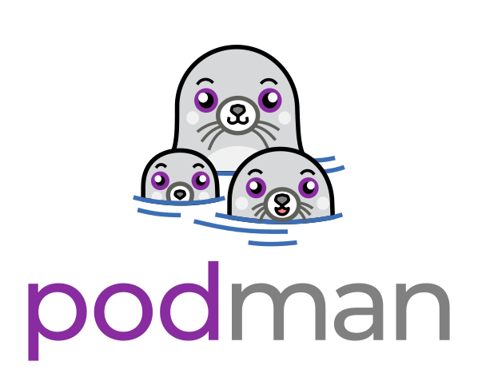

# WS:D3 - Arista AVD: Architect, Validate, and Deploy


> Build, deploy and test L3LS EVPN with Arista AVD

<style scoped>section {font-size: 22px;}</style>

<!-- Do not add page number on this slide -->
<!--
_paginate: false
-->

```python
#!/usr/bin/env python3

__author__ = [
  "Petr Ankudinov (pa@), Senior Solutions Engineer",
  "Guillaume Mulocher (gmulocher@), Senior Solutions Engineer",
  "Patrick Prangl (pprangl@), Systems Engineer"
]
```

```bash
$ date +"%b %Y"                 
May 2025
```

<!-- Add footer starting from this slide -->
<!--
footer: ''
-->

---

# Credits

<style scoped>section {font-size: 24px;}</style>


- Slides are created in [Marp](https://github.com/marp-team/marp) by Yuki Hattori
- Why:
  - Easy to build and share, rich content
  - Also ask yourself why people are presenting in PowerPoint when it comes to automation event. Slides are just another form of Markdown content build by CI.
- Check [Marp awesome list](https://github.com/marp-team/awesome-marp) and build your next slide deck in Marp!
- Most images are from [Pexels](https://www.pexels.com/) or generated by AI

> Scan QR code to access the slide deck.

---

# Agenda

- IaC & network-wide data models w/ VSCode, Git, and AVD
- Initial deployment (Day 0 provisioning)
- Ongoing operations (Day 2 and beyond) of an L3 leaf and spine EVPN/VXLAN fabric.
- Arista Network to Test Automation (ANTA) network validation


---

# What is AVD


<style scoped>section {font-size: 18px;}</style>

- [AVD is an open-source project](https://avd.arista.com)
- AVD stands for "Architect, Validate, and Deploy"
- [Supported designs](https://avd.arista.com/5.2/ansible_collections/arista/avd/roles/eos_designs/index.html) as of AVD 5.2:
  - L3LS EVPN / L2LS / MPLS / Campus
  - WAN AutoVPN/CV Pathfinder
- Roles:
  - `arista.avd.eos_designs` - abstracted to low level variables
  - `arista.avd.cli_config_gen` - parse templates to build plain text configs
  - `arista.avd.cv_deploy` - push configurations to Arista CloudVision Portal (replaced `eos_config_deploy_cvp`)
  - `arista.avd.eos_config_deploy_eapi` - push configs to switches directly. Based on [`arista.eos.eos_config`](https://docs.ansible.com/ansible/latest/collections/arista/eos/eos_config_module.html). [`arista.eos`](https://galaxy.ansible.com/arista/eos) is maintained by RedHat ⚠️
  - `arista.avd.eos_validate_state` - validate operational state of Arista EOS devices (with ANTA)

---

# AVD is Open Source


- AVD was started by Arista community and for Arista community
- Open source means that you can use it for free and have full power as long as you take the responsibility of a power user:
  - Understand and troubleshoot
  - Be part of the community - share your feedback, open Github issues and even PRs

AVD commercial traits:

- Large maintainers team
- Option to buy [A-Care TAC support](https://avd.arista.com/5.4/docs/support/support_overview.html) to fullfil highest expectations

---


---

# ATD (Arista Test Drive) Lab

<style scoped>section {font-size: 24px;}</style>
<style scoped>p {font-size: 24px;}</style>


- You can access the lab guides on [https://labguides.testdrive.arista.com/](https://labguides.testdrive.arista.com/)
- Click [this URL](to-be-defined) to get your lab copy
- Start the lab and wait until it's ready

> While the lab is starting... ⏲️ Let's discuss how to create your own AVD environment.

`Quiz`: AVD / ATD / ACT / ACB / ABC - which one is not valid Arista abbreviation. 😄

---

# AVD Installation Options

<style scoped>section {font-size: 24px;}</style>

<div class="columns">
<div>

- Ansible CE (Community Edition)
  - free to use
  - check [AVD docs](https://avd.arista.com/) for the installation manual
- Ansible Automation Platform
  - paid RedHat support
  - check [AAP guide here](https://avd.arista.com/devel/docs/getting-started/avd-aap.html)
  - out of scope

</div>
<div>

After 4.9 (PyAVD is the foundation ⚠️)

```bash
# ansible-core will be installed as PyAVD requirement
pip install "pyavd[ansible]"
ansible-galaxy collection install arista.avd
# install community.general to support callback plugins, etc.
ansible-galaxy collection install community.general
```

- ⚠️ [PyAVD](https://pypi.org/project/pyavd/) is not intended to be used directly
- Ansible provides a lot of value, for ex. inventory management - use Ansible ⚠️
- However PyAVD is the foundation that allows to solve a lot of Ansible shortcomings

</div>
</div>

---

# Virtual Environment vs Containers

<style scoped>section {font-size: 22px;}</style>

<div class="columns">
<div>

venv/pyenv 📦

- Pro:
  - simple and lightweight
  - no special tools required
- Breaks **often**. Troubleshooting complexity: **average**
- How it breaks:
  - multiple Pythons
  - incorrect requirements installation
  - broken path, custom ansible.cfg, tweaks, etc.
  - `../../../<ansible-collection>` 🤦 🙈

</div>
<div>

Containers 🐳

- Pro:
  - stable, portable
  - high level of isolation
- Breaks **rarely**. Troubleshooting complexity: **high**
- How it breaks:
  - permission issues 👑
    - check [this document](https://code.visualstudio.com/remote/advancedcontainers/add-nonroot-user) to UID requirements
  - broken Docker installation or host OS
  - tools can be "too heavy" for some users 🔨

</div>
</div>

---

# Quickest AVD Test Possible

```bash
podman run --rm -it -w /home/avd ghcr.io/aristanetworks/avd/universal:python3.11-avd-v5.4.0 \
zsh -c "cp -r /home/avd/.ansible/collections/ansible_collections/arista/avd/examples/single-dc-l3ls/* .; ansible-playbook build.yml; cat intended/configs/dc1-leaf1a.cfg"
```

ATD environment is based on the [Coder container](https://coder.com/docs/user-guides/workspace-access/vscode)

> Check appendix for details about installing container engine.

---

# Makefile

<style scoped>section {font-size: 24px;}</style>

- If you need a deeper dive into Makefile syntax and use case - the [makefiletutorial.com](https://makefiletutorial.com/) is the best place to start. You'll be an expert in making Makefiles when you finish. :sunglasses:
- Originally Makefiles were used by C/C++ developers to compile the code.
- Makefiles have a few advantages that make them useful for other use cases:
  - They are simple.
  - They allow assigning a simple shortcut to complex actions.
  - They are available by default on most Linux distributions.
- We are going to use Makefile to create shortcuts to simplify some operations.

---

# Let's Prepare The Lab Environment

<style scoped>section {font-size: 20px;}</style>

- ⚠️ [Fork this repository](https://github.com/aristanetworks/ci-workshops-avd) using your own GitHub account

```bash
# set LABPASSPHRASE env variable
export LABPASSPHRASE=`cat /home/coder/.config/code-server/config.yaml| grep "password:" | awk '{print $2}'`
echo "export LABPASSPHRASE=${LABPASSPHRASE}" >> ~/.zshrc
# clone the lab repository
cd /home/coder/project/labfiles
git clone https://github.com/<your-github-account-name>/ci-workshops-avd.git
cd ci-workshops-avd
# set Git user.name and user.email
git config --global user.name "FirstName LastName"
git config --global user.email "name@example.com"
# upgrade AVD version and requirements
pip3 config set global.break-system-packages true
pip3 config set global.disable-pip-version-check true
pip3 install -r requirements.txt
ansible-galaxy collection install -r requirements.yml
# check if installation is correct
ansible-galaxy collection list
# move to L3LS_EVPN directory
cd labs/L3LS_EVPN
# set initial lab configs
make preplab
```

---

# Q&A


- [Ansible AVD](https://avd.arista.com/)
- [This repository](https://github.com/ankudinov/avd-workshop-may-2025)

```diff
- One more slide!
+ No more slides.
```

```bash
git commit -m "The END!"
```

<!-- Add footer starting from this slide -->
<!--
footer: ''
-->

---

# AVD Lab Environment: Options

<style scoped>section {font-size: 24px;}</style>
<style scoped>p {font-size: 24px;}</style>


- Linux
  - Docker CE
  - [Install directly](https://avd.arista.com/5.2/docs/installation/collection-installation.html)

    ```bash
    pip install "pyavd[ansible]"
    ansible-galaxy collection install arista.avd
    ```

- Windows
  - WSL2 + Docker CE
- MacOS
  - Podman

⚠️ Use a well maintained and healthy machine!

---

# Linux: Install Docker CE

<style scoped>section {font-size: 24px;}</style>
<style scoped>p {font-size: 24px;}</style>

<div class="columns">
<div>

> The install process was tested on Ubuntu LTS

1. Install Docker on the host. You can used one-liner script for that. [Check Docker documentation](https://docs.docker.com/engine/install/ubuntu/) for details.
2. Add your user to the `docker` group.
3. Logout and login again to apply the changes.
4. Check the Docker version and run hello-world container to test functionality.
5. You must be able to run docker commands without sudo if the installation was succesful.

</div>
<div>

```bash
# install Docker
sudo curl -fsSL https://get.docker.com | sh
# add user to the docker group
sudo usermod -aG docker ${USER}
# test docker
docker --version
docker run hello-world
```


</div>
</div>

---

# Windows: Install WSL2 + 

<style scoped>section {font-size: 24px;}</style>
<style scoped>p {font-size: 24px;}</style>

- Install WSL2
  - Check if default Ubuntu distribution is installed
  - Windows will ask to restart the PC 😉
- Install VSCode if not yet installed
- Install remote development extension on VSCode: `ms-vscode-remote.vscode-remote-extensionpack`
- On the first run VSCode will suggest to install Docker in WSL - accept

> You can install Docker CE on WSL2 machine directly, but VSCode is a better option

---

# MacOS: Install  Desktop

- Check [installation docs](https://podman-desktop.io/docs/installation)
- [Download Podman Desktop here](https://podman-desktop.io/downloads)
  - Alternative option - [Homebrew](https://formulae.brew.sh/formula/podman)
- Once Podman Desktop is installed - create Podman machine
  - <ins>__rootful Podman machine❗__</ins> preferred for a lab
- Check `podman run hello`
- Set `alias docker=podman`
  - future slides will be referring to `docker` assuming this alias


